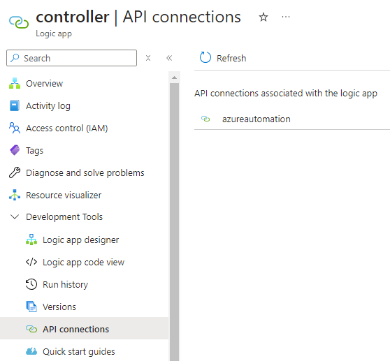

# Find Logic Apps by Api Connection

Azure Portal provides a convinent way to check what Api connections are used by a Logic App. 

For example, you can open up a consumption Logic App and go to the API connections page.



It is sometimes useful to perform the process in reverse. For example, you might find that an API connection has a costs spike in your monthly billing, and you want to confirm if the cost was reasonable. The API connection itself doesn't provide any useful information, so you want to find out which Logic Apps are using it. However, there is no way to view such information on the Azure Portal, so I wrote this script to automate the task.

### script

- Usage
  - replace subscriptionId's value with the subscription you want to search
  - replace apiConnectionId's value with the target Api connection's resource id

```pwsh
$subscriptionId = "<subscription id>"
$apiConnectionId = "<api connection's resource id>"

function Get-ConsumptionLogicApp {
	param (
		$apiConnectionId
	)
	
	$logicAppList = Get-AzLogicApp
	$result = @()
	
	foreach ($logicApp in $logicAppList) {
		$connections = $logicApp.Parameters | ConvertTo-JSON

		if ($connections.ToLower().Contains($apiConnectionId.ToLower())) {
			$result += $logicApp.Id
		}
	}
	return ,$result
}

function Get-StandardLogicApp {
	param (
		$apiConnectionId
	)
	
	$siteList = Get-AzWebApp 
	$standardLogicAppList = $siteList | Where-Object { $_.Kind.Contains("workflowapp") }

	$result = @()
	foreach ($standardLogicApp in $standardLogicAppList) {
		$uri = "https://management.azure.com/$($standardLogicApp.Id)/workflowsconfiguration/connections/?api-version=2018-11-01"
		
		$response = Invoke-AzRestMethod -Method Get -Uri $uri
		if ($response.Content.ToLower().Contains($apiConnectionId.ToLower())) {	
			$result += $standardLogicApp.Id
		}
		Start-Sleep -Seconds 1
	}
	
	return ,$result
}

function Get-LogicApps {
	param(
		$apiConnectionId
	)
	
	$consumptionResult = Get-ConsumptionLogicApp -apiConnectionId $apiConnectionId 
	$standardResult = Get-StandardLogicApp -apiConnectionId $apiConnectionId
	
	Write-Host "Found $($consumptionResult.length) consumption Logic Apps"
	$consumptionResult | Format-List
	
	Write-Host "Found $($standardResult.length) standard Logic Apps"
	$standardResult | Format-List
}


Set-AzContext -Subscription $subscriptionId
Get-LogicApps -apiConnectionId $apiConnectionId
```
