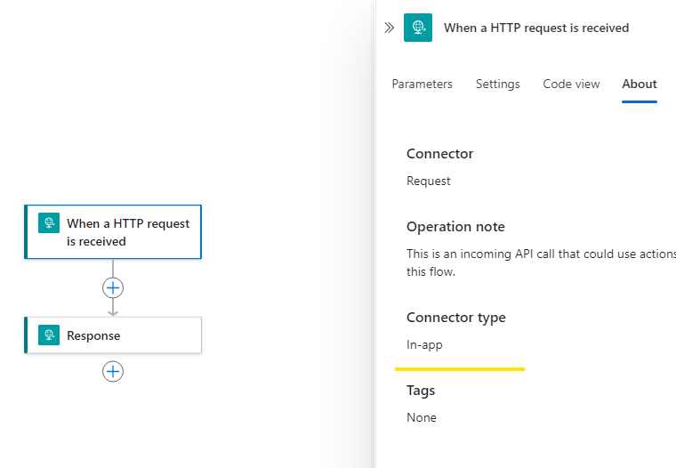
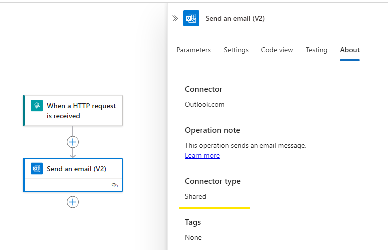
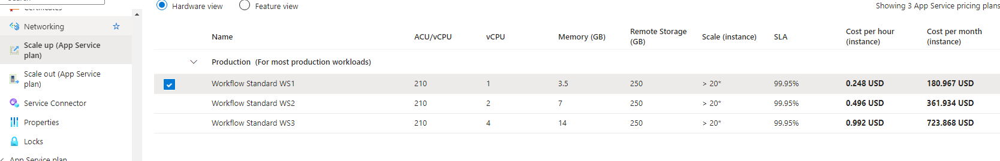

# Logic App Pricing

The [formal documentation](https://learn.microsoft.com/en-us/azure/logic-apps/logic-apps-pricing) includes all the pricing details, but it is complex and hard to follow. I extract the most important part to help you understand the pricing model. Once you finish reading this note, you can refer to the formal documentation for more details.

# Regions

Logic App prices vary by region. This note uses West US as an example. You can check pricing for other regions on this [page](https://azure.microsoft.com/en-us/pricing/details/logic-apps/#pricing).

# Plans

There are consumption and standard plans. Their pricing models are differernt. 

## Consumption Plan

There are three types of costs in a consumption plan:  
	- The number of actions that a logic app actually runs  
	- The number of Api connection calls  
	- Storage

### Actions

- $0.000025 per Execution in West US.

The screenshot is a simple http server which includes two built-in actions. Every time this workflow runs, two built-in actions are metered.

You can check the connector type on the about page of an action.

### Api connection calls 

- $0.000125 per Execution in West US.

Every time your Logic Apps run an action that belongs to a managed connector, the Logic App calls the underlying API connection, which generates a cost.

You can check the connector type on the about page of an action.

### Storage

- $0.12 GB/month in West US.

Your logic apps need storage to store its run history. This storage generates a cost.

## Standard Plan

Buil-in actions are free to use. In addition, there are three types of cost from a consumption plan:  
	- the app service plan  
	- the number of Api connection calls  
	- storage

### App Service Plan (ASP)

Once an ASP is deployed, it starts generating cost until you delete the resource. ASP charges an hourly rate which differs from the allocated vcpu and memory. 

For West US, the hourly rate is around:  
	- 1 vCPU $0.2  
	- 1 GB memory $0.0143  

WS1 is the base tier of a standard plan. We can estimate its cost this way:  
	- WS1 has 1 vCPU and 3.5 GB memory.
	- The hourly rate of one WS1 instance: $0.2 + $0.0143 * 3.5 = $0.25. 
	- The monthly rate of one WS1 instance: $0.25 * 24 * 30 = $180.

The screenshot below is the monthly rate of three pricing tiers for standard logic app. The estimation is for one instance.

Please note that ASP has an auto scale-out feature. When it scales out, more instances are allocated to serve the incoming requests. This results in additional allocation of vCPU and memory, which generates extra costs.

### Api connection calls 

Same as consumption.

### Storage

A standard logic app uses a storage account to store its run history. It follows the storage account's pricing.
