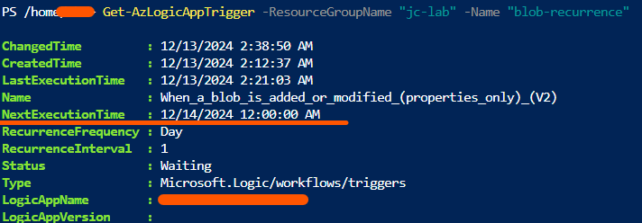
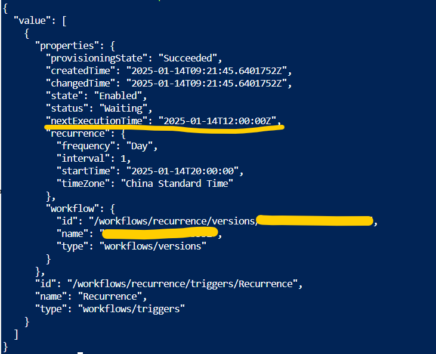

# Verifying the Next Execution Time for a Recurrence Trigger

Knowing the next execution time can help avoid misconfigurations. It's especially useful when the next run starts a few days later, as we don't want to wait that long to confirm if a trigger is working correctly. 

Azure REST API, Azure Powershell, Azure CLI can 

This notes demonstrate the script in powershell. You can do the same thing with Azure REST API, Azure CLI or other SDKs.

## Consumption

- Replace `<subscription id>`, `<resource group name>`, `<workflow name>` with the corresponding values.

```pwsh
Set-AzConText -Subscription "<subscription id>"
Get-AzLogicAppTrigger -ResourceGroupName "<resource group name>" -Name "<workflow name>"
```

The screenshot is the example output.  


## Standard

- Replace `<subscription id>`, `<resource group name>`, `<logic app name>`, `<workflow name>` with the corresponding values.

```pwsh
$subscriptionId = "<subscription id>"
$resourceGroupName = "<resource group name>"
$logicAppName = "<logic app name>"
$workflowName = "<workflow name>"
$uri = "https://management.azure.com/subscriptions/${subscriptionId}/resourceGroups/${resourceGroupName}/providers/Microsoft.Web/sites/${logicAppName}/hostruntime/runtime/webhooks/workflow/api/management/workflows/${workflowName}/triggers?api-version=2024-04-01"

$response = Invoke-AzRestMethod -Method Get -Uri $uri
Write-Host $response.Content
```

The screenshot is the example output.  

